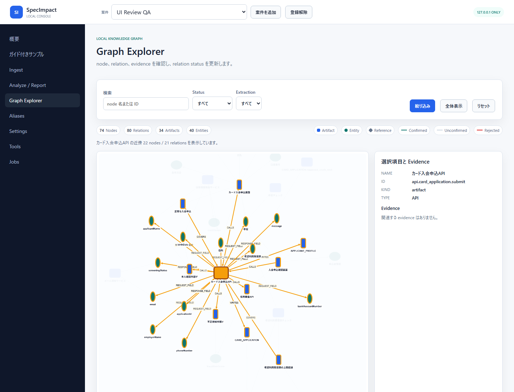

# SpecImpact

SpecImpact は、SIer でよくある汚い Excel 設計書を LLM で読み取り、GraphRAG と evidence 付きレビューで変更影響を管理する OSS です。

> **UX modernization:** 現行GUIを、設計書・影響候補・evidence・人間判断を一つの文脈で扱う
> Evidence Review Workspaceへ段階的に刷新しています。設計原則、現状監査、完了条件は
> [UX Redesign Plan](docs/ux_redesign_plan.md) を参照してください。

設計書を投入すると、画面、API、DB、外部 IF、入力チェック、テスト仕様などを evidence graph に変換します。その後、変更依頼を自然文または Markdown で入力すると、Change Atom として構造化し、グラフ上の依存関係から影響候補を `must_review` / `should_review` / `may_review` / `hidden` に分類します。

SpecImpact の出力は「影響確定」ではなく「レビュー候補」です。LLM の主張だけで `must_review` にはせず、直接 evidence と graph path があるものだけを強く提示します。

## 特徴

- LLM-first の初期導入: Codex CLI、OpenAI API、Ollama、fake provider に対応
- Dirty Excel ingestion: 結合セル、複数表混在、同上、別紙参照、セル範囲 evidence を扱う
- GraphRAG: 設計書から artifact、entity、relation、evidence を JSONL に保存
- Alias review: `利用限度額`、`requestedCreditLimit`、`REQUESTED_CREDIT_LIMIT` などの表記揺れを候補化
- LLM alias judgement: entity ペアごとに `same / related / different / unsure` を判定
- Alias recall 強化: camelCase/snake_case 分解、名前トークン、疑似 embedding 類似、周辺 relation、近傍 evidence を候補生成に利用
- LLM impact hypothesis: `impact_type`、`required_actions`、`warnings`、`uncertainty` を作業仮説として保存
- Verifier: LLM だけの主張を `must_review` にしない安全側の分類
- GUI: localhost 限定の Evidence Review Workspace。影響候補、設計書ハイライト、evidence、Graphを同じ案件文脈で確認
- Obsidian export: Artifact / Evidence / Change / Impact note と Canvas を生成
- OSS 向け評価: release-check、dirty Excel golden、Obsidian snapshot test を整備

標準導線は LLM-first です。ただし外部送信は明示設定と承認が必要です。ローカルだけで試す場合は `--no-llm` を使えます。

```text
Standard provider: Codex CLI
External transmission: preview + approval
Local state: .specimpact/
Backend: local JSONL
Fallback: --no-llm
```

## インストール

```powershell
git clone https://github.com/kanan6377/SpecImpact.git
cd SpecImpact
python -m pip install -e .
specimpact --help
```

GUI も使う場合:

```powershell
python -m pip install -e ".[gui]"
```

## まず試す

Dirty Excel サンプルで、初期導入から変更影響レビューまで確認できます。

```powershell
specimpact onboard .\examples\dirty_sier_excel\docs `
  --provider codex `
  --model default `
  --aliases .\examples\dirty_sier_excel\aliases.yml

specimpact analyze .\examples\dirty_sier_excel\changes\利用限度額上限変更.md --llm-first
specimpact impacts list
specimpact report --format markdown
specimpact export-obsidian .\vault
```

LLM を使わずに構造だけ試す場合:

```powershell
specimpact onboard .\examples\dirty_sier_excel\docs `
  --no-llm `
  --aliases .\examples\dirty_sier_excel\aliases.yml
```

期待される流れ:

- Excel workbook がセル単位 evidence 付きで取り込まれる
- 画面項目表、入力チェック、API 対応表、DB 定義、外部 IF、テストケースが region として検出される
- LLM 抽出結果は Graph Proposal として保存され、承認前は未確定扱いになる
- Alias 候補は evidence quote と周辺 relation 付きでレビューできる
- 変更依頼は Change Atom に分解され、影響候補には required actions が付く
- Obsidian では Dashboard、Artifacts、Evidence、Changes、Impacts、Canvas が生成される

詳しいサンプル説明は [examples/dirty_sier_excel/README.md](examples/dirty_sier_excel/README.md) を参照してください。

## 基本フロー

### 1. LLM provider を設定する

```powershell
specimpact llm configure --provider codex --model default
specimpact llm status
```

OpenAI API:

```powershell
specimpact llm configure --provider openai --model <model>
```

Ollama:

```powershell
specimpact llm configure --provider ollama --model <model> --base-url http://localhost:11434
```

外部送信したくない場合:

```powershell
specimpact llm disable
```

### 2. 設計書を取り込む

Markdown / text:

```powershell
specimpact ingest .\docs --aliases .\aliases.yml
```

Dirty Excel:

```powershell
specimpact ingest .\docs --mode dirty-excel --aliases .\aliases.yml
```

または:

```powershell
specimpact ingest-dirty-excel .\docs --aliases .\aliases.yml
```

表形式 Excel:

```powershell
specimpact ingest-excel .\docs --profile sier --aliases .\aliases.yml
```

Excel の状態確認:

```powershell
specimpact excel inspect .\docs
specimpact excel classify .\docs
```

### 3. 提案をレビューする

Graph Proposal:

```powershell
specimpact graph proposals list
specimpact graph proposals accept <proposal_id>
specimpact graph proposals reject <proposal_id>
```

Alias:

```powershell
specimpact aliases suggest --llm
specimpact aliases review
specimpact aliases confirm <candidate_id>
specimpact aliases reject-candidate <candidate_id>
```

`same` の候補だけが alias として確定できます。`related` は関連はあるが別概念、`different` は別概念、`unsure` は人間確認が必要な候補です。

### 4. 変更影響を分析する

```powershell
specimpact change parse .\changes\change_request.md
specimpact analyze .\changes\change_request.md --llm-first
specimpact report --format markdown
```

自然文を直接渡すこともできます。

```powershell
specimpact change analyze "入会申込画面の利用限度額上限を999万円から9999万円に変更する"
```

Impact decision:

```powershell
specimpact changes list
specimpact impacts list
specimpact impacts set-status <impact_id> accepted --reason "画面/API/DBを修正対象にする"
specimpact impacts set-status <impact_id> closed --reason "実装とテスト完了"
```

## Obsidian 連携

SpecImpact は Obsidian を「レビュー用 knowledge graph」として使います。

```powershell
specimpact export-obsidian .\vault
```

生成される主なファイル:

- `SpecImpact/Dashboard.md`
- `SpecImpact/Artifacts/*.md`
- `SpecImpact/Evidence/*.md`
- `SpecImpact/Changes/*.md`
- `SpecImpact/Impacts/*.md`
- `SpecImpact/Canvases/*.canvas`

Artifact note には relation と evidence link が入り、Impact note には status、review priority、impact type、required actions が入ります。Dataview plugin を入れると未レビュー項目を一覧できます。

旧形式の report コピーだけが必要な場合:

```powershell
specimpact export-obsidian .\vault --report-only
```

## GUI

```powershell
python -m pip install -e ".[gui]"
specimpact gui
```

GUI は `127.0.0.1` のみに bind します。

案件が未登録でもGUI内で案件フォルダーの作成・登録、またはガイド付きサンプルの作成から
開始できます。`設計書` 画面ではMarkdown/text、Dirty Excel、OpenAPI、DDL、CSVをmanaged uploadし、
evidence、artifact、relation、sheetの取り込み件数をSource Libraryで確認できます。

主な画面:

- 概要: graph件数、次のレビュー、案件状態
- 設計書: 原本追加、LLM-first取り込み、Source Library
- 変更レビュー: 起点設計書のGraph Contextと自然文の変更要求、影響候補、設計書ハイライト、Evidence Inspector、選択位置deep link
- ナレッジグラフ: Cytoscapeによるnode/relation探索
- Alias: 同一概念候補と根拠のレビュー
- ジョブと監査: 更新処理、状態、入力、実行時刻
- 設定: LLM、保存先、Privacy Doctor

旧GUIの `/ui/analyze`、`/ui/dirty-excel` などは、案件IDを保ったまま対応する現行画面へ
redirectされます。実行時は外部CDNやNode.jsを必要とせず、wheelにコンパイル済みのfrontendを
同梱します。frontendを変更する開発者だけが `frontend/` で `npm install` と `npm run build` を
実行します。



GUI の詳細は [docs/gui_manual_ja.md](docs/gui_manual_ja.md) を参照してください。

## データモデル

既存 v1 の `documents`、`artifacts`、`entities`、`relations`、`evidence` は維持しています。v2 では次の JSONL collection を追加します。

- Dirty workbook / sheet / cell / region
- Graph proposals
- Alias candidates
- Change requests / Change atoms
- Impact hypotheses
- Impact decisions

LLM の出力は `proposed_by_llm` または `unconfirmed` として扱い、レビューなしで確定情報にはしません。

## 評価とテスト

Dirty Excel benchmark には、以下の golden scenario を入れています。

- 利用限度額上限変更
- 電話番号桁数変更
- 本人確認方式変更
- 外部 IF 項目追加
- DB 桁数変更

開発時の確認:

```powershell
pytest -q
ruff check .
python -m compileall -q specimpact
specimpact release-check .\examples\evaluation\release_cases.yml
```

直近の品質ゲートでは `pytest`、`ruff`、`compileall`、`release-check` を通しています。

## 制限事項

SpecImpact は Excel の見た目を完全理解するツールではありません。

得意なもの:

- 画面、API、DB、外部 IF、入力チェック、テスト仕様が表や文章で書かれている設計書
- 論理名、物理名、日本語名、camelCase、snake_case が混在する SIer 系ドキュメント
- evidence を確認しながら人間がレビューする変更影響管理

苦手なもの:

- 画像だけで貼られた ER 図
- 図形や矢印だけで意味が表現された Excel
- セルの見た目だけに意味があり、文字情報がほとんどない workbook
- 人間レビューなしでの影響確定

図形や画像がある workbook は検出して警告しますが、現時点では意味解析の主対象ではありません。

## ドキュメント

- [日本語ユーザーマニュアル](docs/user_manual_ja.md)
- [CLI リファレンス](docs/cli.md)
- [入力準備ガイド](docs/input_preparation.md)
- [構造化ローダー](docs/structured_loaders.md)
- [プライバシー](docs/privacy.md)
- [評価](docs/evaluation.md)
- [リリース手順](docs/release.md)
- [コントリビューション](CONTRIBUTING.md)
- [セキュリティ](SECURITY.md)
- [GUI redesign sandbox](examples/gui_redesign_sandbox/README_JA.md)

## GitHub 説明文の推奨

GitHub の repository description には、以下を推奨します。

```text
SIerの汚いExcel設計書をLLMとGraphRAGで構造化し、evidence付きで変更影響レビューを管理するOSS
```

Topics:

```text
llm, graphrag, excel, impact-analysis, obsidian, software-design, japanese
```
