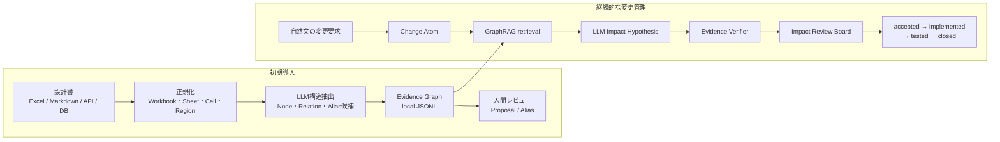
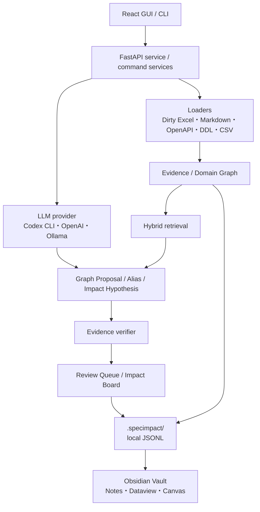

# SpecImpact

<div align="center">

**汚いExcel設計書を、根拠付きの変更影響レビューへ。**

設計書をLLMとGraphRAGで構造化し、自然文の変更要求から
影響候補・依存経路・該当セル・必要作業を提示するローカルファーストOSSです。

[](https://www.python.org/)
[](https://github.com/kanan6377/SpecImpact)
[](LICENSE)

[5分で試す](#5分で試す) · [GUI](#gui) · [仕組み](#仕組み) · [マニュアル](docs/user_manual_ja.md)

</div>


> [!IMPORTANT]
> v1.2.0はAlphaです。出力は影響の確定結果ではなく、人間が確認するレビュー候補です。

## 解決する課題

SIerの設計書では、同じ項目が画面、入力チェック、API、DB、外部IF、テスト仕様へ分散し、
日本語名・camelCase・snake_caseも混在します。単純な全文検索では「見つかった箇所」は分かっても、
**なぜ変更対象なのか、どの経路で依存しているのか、どこまで確認したか**が残りません。

SpecImpactは設計書をevidence付きgraphへ変換し、変更管理を次の形にします。

| 入力 | SpecImpactが行うこと | レビュー結果 |
| --- | --- | --- |
| Dirty Excel / Markdown / OpenAPI / DDL / CSV | セル・表・項目・relationを抽出 | Artifact / Entity / Evidence Graph |
| 表記揺れ | LLMと周辺relationでalias候補を比較 | `same / related / different / unsure` |
| 自然文の変更要求 | Change Atom化して関連subgraphを探索 | 影響候補、graph path、required actions |
| 再取り込み | source hashとrelation差分を比較 | staleなrelation / impactを再レビュー |

## 基本ワークフロー



LLMの出力は確定情報ではなくproposal / hypothesisです。直接evidenceとgraph pathを検証できる候補だけを
強く提示し、最終判断は人間が行います。

## 主な機能

- **Dirty Excel理解**: 結合セル、複数表、改訂履歴、コメント、リンク、非表示行列、同上、別紙参照を保持
- **LLM-first GraphRAG**: Codex CLI、OpenAI API、Ollamaに対応
- **Alias解決**: `利用限度額`、`requestedCreditLimit`、`REQUESTED_CREDIT_LIMIT`を根拠付きで比較
- **変更影響分析**: `impact_type`、`required_actions`、`warnings`、`uncertainty`を作業仮説として生成
- **Evidence Verifier**: LLMだけの主張を`must_review`へ昇格させない
- **設計書ビューア**: 影響候補から該当行・Excelセルへ移動し、検索結果のようにハイライト
- **統一Review Queue**: Graph Proposal、Alias、Relation、Impact、Graph Diffを同じ画面で判断
- **Freshness管理**: 再取り込み時のsource version、graph diff、stale dependencyを永続化
- **Obsidian連携**: Wiki link、frontmatter、Dataview、Canvas付きのknowledge graphを出力
- **ローカルファースト**: JSONL backend、localhost GUI、外部送信preview、送信監査metadata

## 5分で試す

### 1. インストール

```powershell
git clone https://github.com/kanan6377/SpecImpact.git
cd SpecImpact
python -m pip install -e ".[gui]"
specimpact --version
```

Python 3.11以降が必要です。

### 2. GUIでガイド付きサンプルを開く

```powershell
specimpact gui
```

`http://127.0.0.1:8765`が開きます。案件が未登録の場合は**「ガイド付きサンプルを作成」**を選ぶと、
外部LLMなしでレビュー画面を確認できます。

### 3. CLIでローカル実行する

```powershell
specimpact onboard .\examples\dirty_sier_excel\docs `
  --no-llm `
  --aliases .\examples\dirty_sier_excel\aliases.yml

specimpact analyze `
  .\examples\dirty_sier_excel\changes\利用限度額上限変更.md `
  --llm-first --no-llm

specimpact impacts list
specimpact report --format markdown
```

LLMを使う標準導線:

```powershell
specimpact onboard .\examples\dirty_sier_excel\docs `
  --provider codex --model default `
  --aliases .\examples\dirty_sier_excel\aliases.yml
```

外部providerを利用する処理では、送信先・目的・件数を表示して承認を求めます。

## GUI

Evidence Review Workspaceは、設計書と影響候補を別画面へ分断せず、同じレビュー文脈で扱います。


| 画面 | 用途 |
| --- | --- |
| 概要 | graph件数、次のレビュー、案件healthを確認 |
| 設計書 | 原本追加、検索可能な一覧、押下して開くインラインビューア、Excelシート切替 |
| 変更レビュー | 自然文入力、影響候補、設計書ハイライト、Evidence Inspector |
| ナレッジグラフ | node / relation探索、stale表示、キーボード選択 |
| レビュー | Proposal、Alias、Relation、Impact、Graph Diffの判断 |
| Obsidian | Vault export、LLM送信監査、review replay |
| ジョブと監査 | 非同期処理、失敗理由、復旧手順 |

GUIは`127.0.0.1`だけにbindし、runtime CDNやremote fontを使用しません。frontendはwheelへ同梱済みです。

## 仕組み



### データの扱い

- 既定backendは案件内の`.specimpact/`に保存するlocal JSONL
- 原本は`.specimpact/sources/original/`へ保持
- Excel evidenceはworkbook / sheet / cell / range / quoteへ戻れる
- LLM traceはprovider、model、purpose、hashなどの監査metadataだけを保存
- source hashが変わると、依存するrelation / impactを`stale`として再レビューへ戻す

### Impact priority

| Priority | 意味 |
| --- | --- |
| `must_review` | 直接evidenceと明示graph pathがある |
| `should_review` | 強い関連があるため確認すべき |
| `may_review` | LLM推論または弱い関連を含む |
| `hidden` | verifier条件を満たさず通常表示しない |

`must_review`は「影響確定」ではありません。レビュー優先度です。

## LLM provider

| Provider | 用途 | 外部送信 |
| --- | --- | --- |
| Codex CLI | 標準のLLM-first導線 | 承認必須 |
| OpenAI API | structured extraction / impact hypothesis | 承認必須 |
| Ollama localhost | ローカルモデル | 不要 |
| `--no-llm` | heuristic / graph-only fallback | なし |

```powershell
specimpact llm configure --provider codex --model default
specimpact llm status
```

## Obsidian

```powershell
specimpact export-obsidian .\vault
```

次の構成を生成します。

```text
SpecImpact/
├── Dashboard.md
├── Artifacts/
├── Evidence/
├── Changes/
├── Impacts/
└── Canvases/
```

Artifact間のrelationは`[[Wiki Link]]`へ変換され、Impact statusやsource locationはfrontmatterへ入ります。
SpecImpactのlocal JSONLがsource of truthで、Obsidianは探索とレビュー用のprojectionです。

## 安全性と設計原則

1. **Evidence-first**: confidenceではなく、引用とrelation pathを示す
2. **Review-assist**: 設計書を自動編集せず、最終判断を自動化しない
3. **Local-first**: 外部providerを設定しない限り文書を外へ送らない
4. **Inspectable**: proposal、判断、source version、graph diff、traceを永続化する
5. **Alias-aware**: 文字列一致だけで同一概念と決めない

外部送信前には氏名、メール、電話番号、顧客番号、口座番号、URL、API key形式を検出・maskします。
ただしredactionは補助策であり、送信previewと明示承認を省略しません。

## 対応入力と制限

| 対応 | 状態 |
| --- | --- |
| Markdown / text | 対応 |
| Dirty Excel `.xlsx` | セル・region・style・comment・hyperlink・hidden情報に対応 |
| OpenAPI / DDL / CSV | structured loader対応 |
| 画像・図形を含むExcel | 存在を警告し、意味解析は限定的 |
| 画像だけのER図 | 未対応 |

SpecImpactは設計書の見た目を完全理解するツールではありません。文字・表・セル構造を主な解析対象とします。

## 品質ゲート

```powershell
pytest -q
ruff check .
python -m compileall -q specimpact
specimpact release-check .\examples\evaluation\release_cases.yml
```

v1.2.0では145 testsと21件のrelease benchmarkを通過しています。テストは外部LLMを呼ばず、
FakeLLMClientでstructured output、evidence検証、alias判断、impact hypothesisを固定します。

## ドキュメント

- [日本語ユーザーマニュアル](docs/user_manual_ja.md)
- [GUIマニュアル](docs/gui_manual_ja.md)
- [CLIリファレンス](docs/cli.md)
- [入力準備ガイド](docs/input_preparation.md)
- [Evidence model](docs/evidence_model.md)
- [Privacy](docs/privacy.md)
- [Evaluation](docs/evaluation.md)
- [Release validation](docs/release.md)
- [Contributing](CONTRIBUTING.md)
- [Security policy](SECURITY.md)

## ライセンス

[Apache License 2.0](LICENSE)
