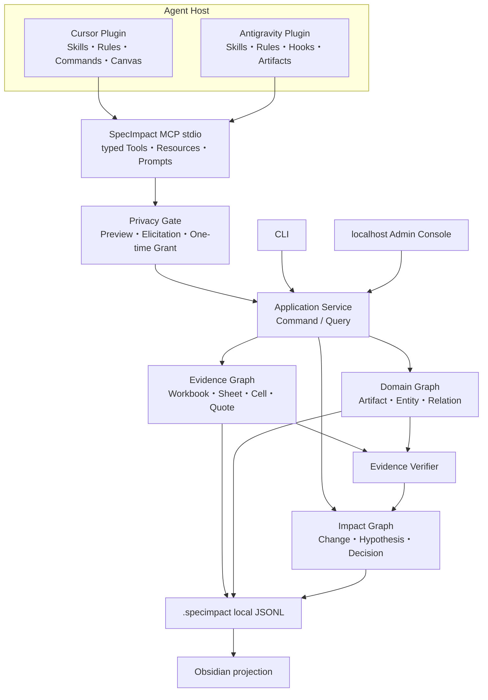
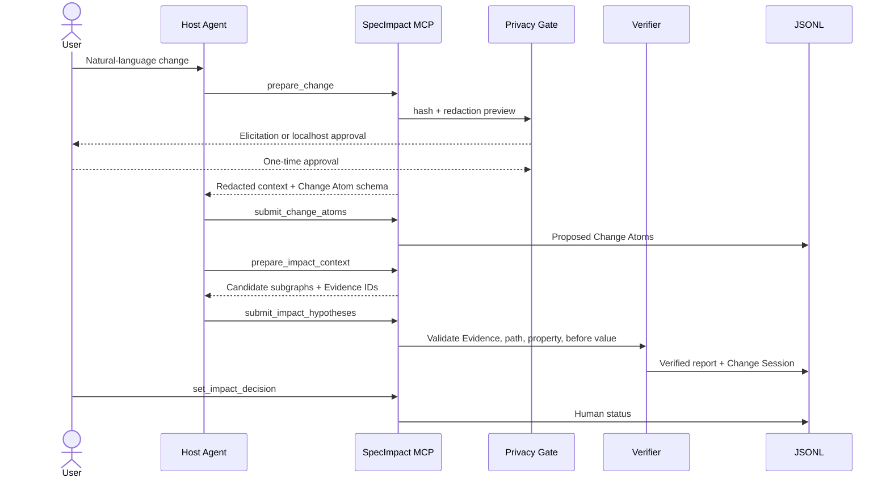
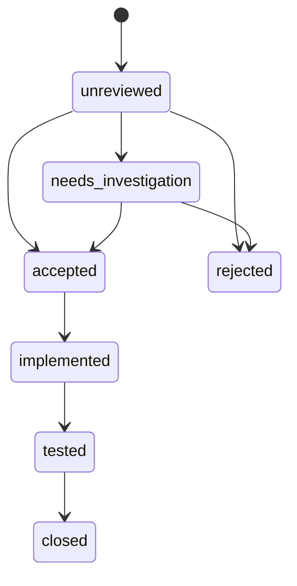

# Agent Host Architecture

## Specification kernel boundary

All existing report-producing paths additionally call `semantic/service.py`, which captures
normalized ingestion state and invokes one bounded kernel. SQLite owns immutable analysis
snapshots, results and decision events; JSONL remains the legacy ingestion and compatibility
surface shown below. `specimpact.locking` supplies a common reentrant process lock without
depending on Application imports. See [the kernel contract](specification_kernel.md) for current
rules, normalized-source retention, transport behavior and migration limits.

## Runtime Boundaries

MCP, CLI, and Web do not own separate domain logic. They call the same Application layer. Cursor
Canvas, Antigravity Artifact, Admin Console, reports, and Obsidian are replaceable projections.

## Host Change Sequence

## Status Ownership

Only an explicit human action changes Impact Decision status. `must_review` is a verifier-backed
review priority, not a decision state.

## Concurrency And Recovery

- `.specimpact/write.lock` serializes cross-process mutations.
- hashed idempotency keys replay completed mutations without running them twice.
- `.specimpact/jobs.jsonl` survives host restarts; queued/running records become interrupted.
- source hash changes generate graph diff and stale review records.
- MCP Tasks are not required; durable Job tools are the stable compatibility layer.
