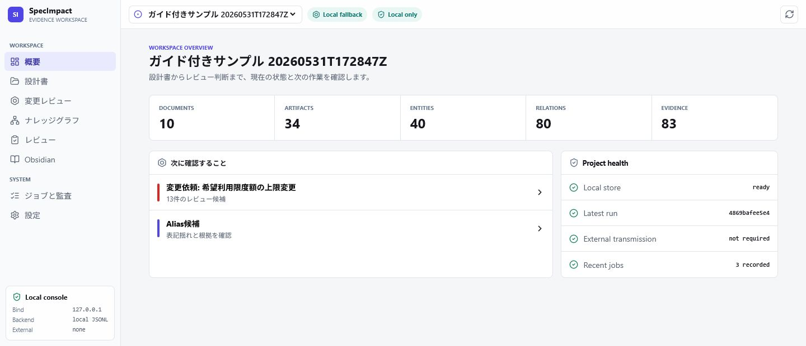
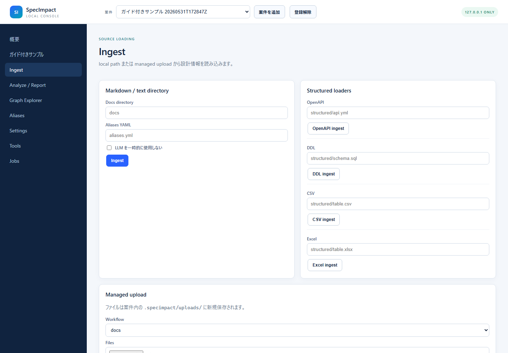
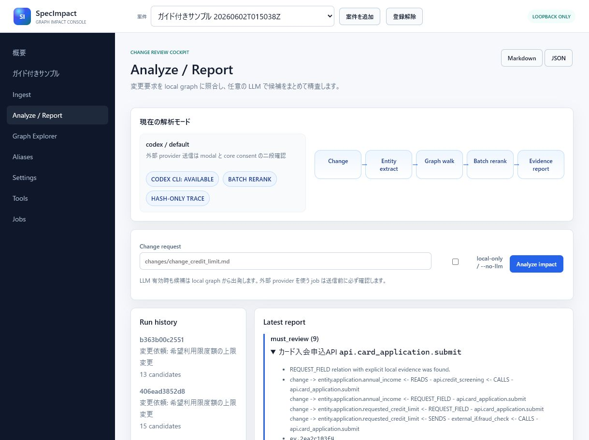

# SpecImpact GUI Manual

SpecImpact GUI は、設計変更の影響範囲を「候補 + relation path + 引用行」で追える
localhost 専用コンソールです。設計書を local knowledge graph に変換し、変更要求に関係しそうな
API、画面、DB、外部 IF、テストを根拠つきで並べます。

LLM は任意です。OpenAI、Ollama、Codex CLI を使う場合も、外部送信は job 単位で確認されます。
LLM を切っても local graph だけで分析できます。

## 1. 何ができるか

- 設計書から artifact、entity、relation、evidence を抽出する
- 変更要求から影響候補を `must_review` / `should_review` / `may_review` に分類する
- 候補ごとに relation path と引用元ファイル、行番号、quote を表示する
- Graph Explorer で relation を確認し、`confirmed` / `rejected` にレビューできる
- 任意の LLM で entity 抽出と batch rerank を行う
- job 履歴、trace、privacy doctor で「何を保存したか」を確認できる

SpecImpact は最終判断を自動化しません。レビュー候補を作り、根拠を集め、人間が判断するための
ツールです。`must_review` は「影響あり」ではなく「必ず確認すべき」という意味です。

## 2. 起動

```powershell
cd <repo-dir>
python -m pip install -e ".[gui]"
specimpact gui
```

よく使う option:

```powershell
specimpact gui --port 8765
specimpact gui --project C:\work\my-system-impact
specimpact gui --no-open-browser
```

GUI は常に `127.0.0.1` に bind します。LAN 公開 option はありません。

## 3. 30 秒 quick tour

1. `ガイド付きサンプル` で `サンプルを作成`
2. `サンプル解析を実行`
3. `Analyze / Report` で候補、理由、evidence を確認
4. `Graph Explorer` で relation path を眺める
5. `Settings` で `codex / default` などを設定し、LLM ありの analyze を試す

local-only の標準サンプルは 13 candidates を生成します。Codex CLI を有効にすると、変更要求の解釈と
候補精査に LLM が使われ、追加候補が出る場合があります。



## 4. メンタルモデル

SpecImpact GUI は black box ではありません。

```text
design docs
  -> local graph
  -> change entity extraction
  -> graph walk
  -> optional LLM batch rerank
  -> report with evidence
```

重要なのは、LLM に設計書一式を丸投げしないことです。まず local graph が候補と根拠を作り、
LLM は変更要求の読み取りと候補の精査を手伝います。

## 5. Dashboard

Dashboard は Launchpad です。

- `documents` / `artifacts` / `entities` / `relations` / `evidence` の件数
- 最新 run
- backend
- LLM provider
- Privacy doctor
- 最近の Jobs

標準状態は以下です。

```text
LLM: disabled
External transmission: none
Backend: local JSONL
Embeddings: local
```

`Project pulse` では、graph が作れているか、最新 run があるか、外部 LLM 送信が発生する設定かを
まとめて確認できます。

## 6. Ingest

読み込み対象:

- Markdown / text directory
- aliases YAML
- OpenAPI
- DDL
- CSV
- Excel
- managed upload

managed upload は案件内の `.specimpact/uploads/<timestamp>-<uuid>/` に保存されます。元ファイルを
上書きしません。1 file は 25 MB まで、1 submission は 200 files までです。



## 7. Analyze / Report

`Change request` に Markdown の変更要求を指定し、`Analyze impact` を実行します。

`local-only / --no-llm` を有効にすると、その job では LLM を使いません。LLM を有効にしている場合は、
次の 2 つに使われます。

- 変更要求からの entity 抽出
- 候補の batch rerank

batch rerank は候補をまとめて LLM に渡すため、Codex CLI provider でも候補ごとに subprocess を
起動するより速くなります。

レポートには以下が出ます。

- priority
- candidate 名と artifact ID
- local rule による reason
- relation path
- evidence ID
- ファイル、行番号、quote
- LLM judgement と LLM reason

レポートは影響確定結果ではなくレビュー候補です。priority は確認順序の目安であり、業務影響を
自動確定するものではありません。



## 8. Graph Explorer

Graph Explorer はレビュー用の作業台です。

- node / relation を canvas で確認
- relation table から edge を選択
- status、extraction method、検索で filter
- edge の evidence を確認
- relation status を `confirmed` / `unconfirmed` / `rejected` に更新

relation status の更新は mutating API なので、案件 queue を通して保存されます。


## 9. Settings

### LLM provider

利用可能な provider:

| Provider | 用途 | 外部送信確認 |
| --- | --- | --- |
| `openai` | OpenAI API | 必要 |
| `ollama` | Ollama API | remote URL は必要、localhost は不要 |
| `codex` | ログイン済み Codex CLI | 必要 |
| `fake` | テスト用 deterministic provider | 不要 |

Codex CLI を使う場合:

```powershell
codex login
```

Settings で provider に `codex`、model に `default` または使いたい model 名を指定します。
Codex provider は `codex exec` を ephemeral session、空の一時 working directory、read-only sandbox で
呼び出します。

### Embeddings

`local` embeddings は外部送信しません。`openai` embeddings は外部送信確認が必要です。

### Backend

標準は local JSONL backend です。Neo4j は optional integration です。

## 10. 外部送信と privacy

OpenAI、Codex CLI、remote Ollama、OpenAI embeddings を使う job は、enqueue 前に確認 modal を表示します。
modal には provider、model、用途、送信対象数が表示されます。

承認は今回の job にのみ有効です。次回へ保存されません。GUI で承認しても、core 側の consent check が
もう一度実行されます。

保存しないもの:

- API key
- 文書本文を含む job 履歴
- provider の raw response
- prompt 本文

保存するもの:

- graph JSONL
- report
- evidence quote と出典行
- trace の prompt hash / response hash / 安全な result summary

## 11. Jobs

更新処理は案件ごとの queue で直列実行されます。別案件の job は並行実行できます。

| 状態 | 意味 |
| --- | --- |
| `queued` | 実行待ち。取消可能です。 |
| `running` | 実行中。 |
| `succeeded` | 正常終了です。 |
| `failed` | 入力または処理に失敗しました。 |
| `cancelled` | 実行前に取り消されました。 |
| `interrupted` | server 再起動時に実行待ちまたは実行中だった job です。 |

履歴は案件内の `.specimpact/gui/jobs.jsonl` に保存されます。

## 12. CLI 対応表

| GUI | CLI |
| --- | --- |
| 案件を初期化 | `specimpact init` |
| Markdown / text ingest | `specimpact ingest` |
| Structured loaders | `specimpact ingest-openapi`, `ingest-ddl`, `ingest-csv`, `ingest-excel` |
| Analyze / Report | `specimpact analyze`, `specimpact report` |
| Graph Explorer | `specimpact inspect ...`, `specimpact relations set-status` |
| Aliases | `specimpact aliases ...` |
| Settings | `specimpact llm ...`, `embeddings rebuild`, `backend set` |
| Tools | `specimpact eval`, `release-check`, `review import`, `baseline create`, `graph diff`, `export-obsidian` |
| Privacy doctor | `specimpact doctor --privacy` |

## 13. OSS リリースチェック

- README に quickstart、出力例、GUI screenshot を載せる
- `pyproject.toml` の repository URL が実リポジトリを指すことを確認する
- `SECURITY.md` と packaged publication metadata の連絡先が一致することを確認する
- サンプルが synthetic data であることを明記する
- `pytest -q`、`ruff check .`、`python -m compileall -q specimpact` を通す
