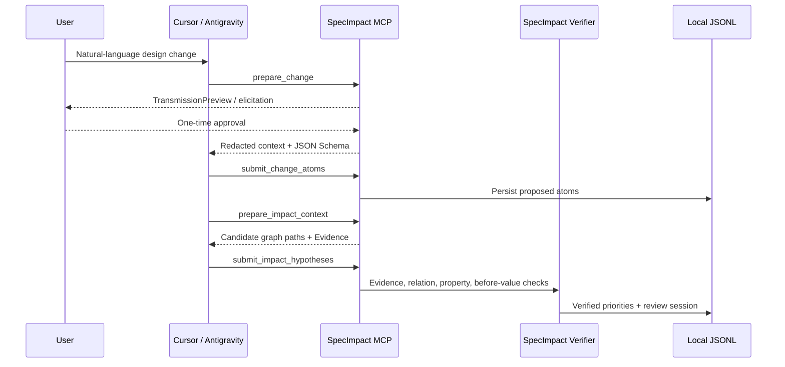

# Host LLM Flow

## Standard Route

Cursor and Antigravity are the standard LLM hosts. SpecImpact does not require an OpenAI, Codex, or
Ollama provider configuration for this route.

If the host advertises MCP sampling, `HostSamplingAdapter` requests the structured draft from the
host model during `prepare_*`. Otherwise the host Skill receives the same context and returns its
structured result through `submit_*`. A sampling failure fails closed and falls back to the Skill
round trip without exposing exception or response bodies.

If neither host path is available, the existing configured SpecImpact provider is next. Heuristic
analysis is the final fallback. A working host prepare/submit route is not labelled degraded when
no SpecImpact provider is configured.

Dirty Excel onboarding follows the same contract. `ingest_sources` first normalizes the workbook
locally and returns Region IDs in the completed Job. For each Region, the host uses
`prepare_graph_context` and `submit_graph_extraction`. Invalid Evidence or node references are
rejected, and an accepted/rejected Graph Proposal rebuilds the affected workbook graph.

## Verification

Host output is never authoritative by itself:

- unknown candidate nodes, relation IDs, and Evidence IDs are rejected
- Change Atom before/after values must occur in the submitted change request
- `must_review` requires persisted direct Evidence and a graph path
- a priority suggestion can lower verifier priority but cannot raise it
- evidence-free host claims remain `hidden` or `may_review`
- `required_actions`, warnings, impact type, and uncertainty remain review hypotheses

The verified report is written through the same report store as CLI analysis. Impact decisions
therefore appear immediately in the Admin Console, CLI, and Obsidian export.

## Audit

Host audit rows use `provider: host:cursor` or `host:antigravity`, the model name when returned or
`unknown`, purpose, item count, redaction state, source hash, prompt/response hashes, and Evidence
IDs. Prompt bodies, response bodies, source bodies, tokens, and API keys are excluded.

Schema violations are recorded as field locations and error types only. The invalid response body
is not written to the warning ledger.
