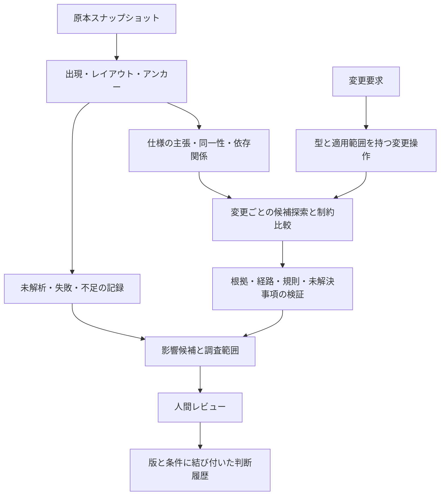

# SpecImpact 再設計方針案

作成日: 2026-09-06  
状態: 検討案。実装フェーズの開始・完了や、次期リリース仕様の確定を意味しない。

## 1. 目指すもの

**分散した設計書について、仕様変更によって確認すべき不整合と依存先を、原典・推論過程・未確認範囲付きで提示するローカルのレビュー支援エンジン。**

主な利用者は、Excelを中心とする既存システムの設計変更を調査するSE・設計リーダー・レビュアーと想定する。最初に成功させる仕事は、「複数設計書にまたがる項目の制約変更について、調査と根拠整理の時間を減らし、確認漏れを減らすこと」。この利用者像はREADMEとサンプルからの仮説であり、実利用者の観察で検証する。

ユーザーが知りたいのは、関連ファイル一覧だけではない。

- 変更要求をどう解釈したか。対象・旧仕様・新仕様・適用条件は何か。
- どの仕様と衝突する可能性があるか。画面・API・DB・外部IF・テストへどう伝わるか。
- その説明を支える原典はどこか。途中に推測・古い資料・矛盾はないか。
- どこまで調べ、何が読めず、何を追加確認する必要があるか。
- 人が判断した後、どの前提が変わったら再レビューが必要か。

高度化の中心を、仕様の表現、変更の意味、検証可能性、調査範囲の説明に置く。Evidence-first、Review-assist、Local-first、Inspectable、Alias-awareは維持する。

## 2. 現状の理解と設計上の課題

README上はv1.3.0 Alpha。実装にはDirty Excel、Graph Proposal、Alias判断、Change Atom、Host LLM、MCP、Admin Console、Freshness、レビュー履歴まである。alpha-1の段階制約を現在のExcel・GUI実装の禁止とは解釈しない。

調査時の作業ツリーにはFintan関連を含む未コミット変更がある。本案はその現在の内容を読んだもので、既存変更を上書きしない。

| 確認した実装・資料 | 観察した事実 | 再設計への含意 |
| --- | --- | --- |
| `impact_management/change_atoms.py` | property/before/afterを持つが値は文字列。`_target_terms`に利用限度額向けaliasの補完がある | 型・単位・適用範囲を持つ変更表現と、業務別知識の分離が必要 |
| `impact_management/impact_retrieval.py` | 対象語をまとめてseed化し、主に逆向き探索。ノードごとに最短経路を保持し、同距離のEvidenceを合流 | 変更ごとの到達理由と複数経路を分離し、関係の意味に応じて伝播させる |
| `impact_management/impact_hypothesis.py` | `_best_atom`が常に`atoms[0]`を返す | 複合変更と候補の対応を第一級のデータにする |
| `application/host_workflow.py` | prepareでも`atoms[0]`を候補に付与し、送信候補を先頭100件に制限 | Host経路も同じ変更単位の分析結果を使い、切り捨て・未処理を明示する |
| `llm_graph/verifier.py` | 引用中の対象語・旧値の部分文字列一致、経路中のexplicit関係の有無、propertyとartifact種別で優先度を判定 | 引用の存在と、引用が主張を支えることを分ける。任意の自然言語の正しさまで検証済みとは扱わない |
| `llm_graph/graph_merge.py` | `depends_on`→`CALLS`、`same_as`→`MENTIONS`などへの正規化がある | 異なる関係の意味を保持し、型・方向・伝播規則を明文化する |
| `llm_graph/entity_resolution.py` | 周辺関係付きalias比較がある一方、業務語のハードコードと全entityペア比較もある | スコープ付き同一性と候補絞り込みを設計する |
| `impact_management/impact_hypothesis.py` | evidence strengthをpriorityから導出。過去判断をcandidate node単位で参照 | 根拠の状態と作業優先度を独立させ、判断の適用範囲を限定する |
| `store.py` | JSONL全件読み込みとcollection単位のatomic replace。graph mergeは複数collectionを順次更新 | 単一ファイルの原子性を、分析スナップショット全体の原子性へ広げる |
| `source_freshness.py` | SourceVersion、GraphDiff、StaleRecordが既にある | 既存の版管理を、旧Evidenceと判断根拠の再現まで拡張する |
| `core.py` / `impact_management` / `application/host_workflow.py` | 分析・優先度・レポート構築に複数の経路がある | 一つの分析カーネルと共通結果契約へ集約する |

これらはコード読解による観察である。全経路の障害再現、速度限界、実利用上の発生頻度を実証したものではない。

公開Fintan実験の報告は、選定21冊・「プロジェクト名128→256」の1変更で、期待19冊とEvidenceアンカー20件を検出している。これは有用な回帰基準だが、未知業務や多様な変更への一般性能とは区別する。未解析Drawing/Imageが12シートにあることも報告されている。`docs/evaluation.md`の旧い評価制約と、この実験後の到達点は次の評価整備で同期する。

## 3. 中核を「仕様の主張」と「変更の作用」にする

現在のArtifact / Entity / Relation / Evidenceを、下記の責務へ整理する。以下の名称は概念案であり、この時点でクラスやファイルを作らない。

| 概念 | 内容 |
| --- | --- |
| SourceSnapshot / Anchor | どの版の原本の、どのセル・範囲・行に由来するか |
| Mention | 原本上の出現。用語の出現だけでは同一実体と断定しない |
| Entity / IdentityAssertion | システム・サブシステム・画面・APIなどのスコープを持つ実体と、同一性の根拠 |
| SpecAssertion | 主語、仕様property、演算子、型付き値、単位、適用条件、原典、抽出方法、レビュー状態 |
| Dependency | 意味と方向を保った関係。写像・変換・入力検証・保存・試験対象など |
| ChangeSet / ChangeOperation | 変更対象、旧値、新値、適用範囲、前提、複数操作の関係 |
| ImpactCase | 変更操作と対象仕様を結ぶ候補。必要作業と検証の内訳 |
| ReviewDecision | 判断者、理由、対象ChangeSet、根拠の版、適用条件、判断履歴 |
| AnalysisRun / Coverage | 入力スナップショット、規則版、解析済み範囲、未処理、探索打ち切り、再現情報 |

同じ「顧客番号」でも別サブシステムでは別entityであり得る。同じ業務概念を表す画面項目とDBカラムも、変換や長さが違う場合がある。別名、同一実体、関連項目、写像を区別し、承認されたaliasにもスコープと版を付ける。

SpecAssertionは「原典がこう述べている」という記録であり、システムの真実を保証するものではない。矛盾する設計書は両方の主張を残す。どの資料を優先するかは明示設定または人間判断とし、最も新しいファイルを無条件に正としない。

## 4. 変更を仮に適用し、不整合の候補を調べる

最初は桁数・上下限・必須条件のうち、意味を限定できるものから始める。原本は編集せず、固定された仕様スナップショットに変更後の条件を重ねて比較する。

説明用の架空例として、「プロジェクト名の最大長128文字を256文字にする」を考える。

| 仮定した現行仕様 | 調査で返すべき内容 |
| --- | --- |
| 入力チェックが128文字、API入力も128文字 | 同じ対象・条件なら、新仕様との制約不整合候補として原典を提示 |
| DBは512文字を保持でき、同一文字数単位の無変換保存が確認済み | この長さ制約に限り、DB拡張の必要性は検出されない。変更セット全体の影響なしとはしない |
| 外部IFが128バイト、文字コード不明 | 文字数との単純比較を保留し、文字コード・変換・切り詰め有無を確認事項にする |
| 128文字許可・129文字拒否の境界テスト | 旧境界の期待結果と、新境界256/257の試験観点の見直し候補 |
| 別システムの同名項目 | 同一性が確認できるまで、確定した伝播経路へ混ぜない |
| 仕様が画像内にしかない | 未解析領域として明示し、追加確認へ送る |

この比較には、値の型・単位・条件・写像が必要になる。適用条件が不明なときは推定で埋めず、未解決の前提として残す。任意の業務ロジックを完全形式化することは初期範囲に含めない。

依存伝播は、単純なhop数だけで決めない。「文字数変更が同一値の保存先へ伝わる」「表示専用ラベル変更がDB容量に伝わるとは限らない」など、関係型・変更property・前提に応じた小さな検証可能な規則にする。循環、候補上限、適用不能な規則は実行記録へ残す。

## 5. Evidenceの検証を段階化する

各ImpactCaseに、少なくとも次の検証内訳を持たせる。

1. 参照検証: Evidence IDが存在し、分析対象の原本版とアンカーに対応する。
2. 対象検証: 対象entity・property・値がどのセルや記述に対応するかを示す。
3. 経路検証: 各関係の方向・型・根拠・レビュー状態・鮮度が分かる。
4. 規則検証: どの変更規則を、どの前提へ適用したかを再生できる。
5. 未解決事項: 矛盾、欠落した単位、曖昧な同一性、推定による接続を列挙する。

LLMによる意味解釈はproposalとして残す。アンカーの存在確認だけで自由文の主張を「証明済み」にしない。決定論的に確認できる構造・限定された制約と、人間が確認すべき解釈を区別する。

`review_priority`、`evidence_strength`、人間の採否は独立した軸とする。重大なIFの根拠不足を高優先で調べることもあり得る。優先度を変えても根拠の強さが自動で変わらないようにする。

公開Impactの既存必須項目は互換表示で維持する。内部では`atom_id`、仕様ID、検証内訳、規則ID、分析版などを持ち、契約の版を明示する。`confidence`は出力しない。Aliasの現行`confidence_label`も、根拠と未解決事項への置換を検討する。

## 6. 見つからなかった範囲も成果物にする

取込時に、ファイル・シート・領域ごとの処理状態を残す。空白、対象外、解析済み、未対応形式、解析失敗、要レビューを区別する。未解析の図形をシート分類成功率に埋もれさせない。

候補取得は、名称・識別子・alias・原文検索・任意の意味検索・依存経路を独立した取得経路として扱う。グラフに未接続でも、原典に対象語がある箇所は調査候補にできる。採用・除外・打ち切りの理由を保持する。

件数制限や時間制限に達した結果は部分結果として返す。検索結果ゼロ、未解析、限定した条件で不整合を検出しなかった状態を区別する。「資料を登録したので全仕様を理解した」という表示はしない。

未知の影響先を含む真の完全性は測定できない。Coverageには分母を付け、読み取り範囲、既知対象の探索範囲、ベンチマーク上の再現率を別々に表示する。

## 7. LLM・保存・操作面の設計

LLMは、自由な帳票の意味抽出、変更の分解、alias候補の比較、追加調査の提案、説明文の作成に使う。LLMが提案した追加探索は回数・範囲を制限し、取得履歴を残す。固定パイプラインと決定論的な検証を先に整える。

同じ入力でもLLMの再生成が同一になるとは保証しない。承認済みの構造化出力、入力hash、schema・prompt・provider/model・規則の版を保存し、既存出力を使った分析再生を可能にする。外部送信の明示設定・確認・最小化と、APIキー不要のFakeLLMClientテストを維持する。

CLI・MCP・Admin Consoleが同じ分析カーネルを呼ぶ構造へ集約する。Hostは交換可能な操作・生成アダプタとする。既存の原典ビューア、承認機構、Jobs/Audit、レビュー導線は再利用する。

保存は、原本スナップショットとトランザクションを持つローカルDBの組合せを第一候補にする。SQLiteはローカルアプリ向けの利用例があり、単一トランザクションの更新を一括で確定または取消できる。[SQLiteの用途](https://www.sqlite.org/whentouse.html)、[トランザクション保証](https://www.sqlite.org/transactional.html)。採用判断は本プロジェクトでの障害復旧・移行・速度計測に基づく。

JSONLは監査・交換・差分確認用に残す。DBとJSONLを両方正本にする二重書込みは避ける。分析は固定snapshotを参照し、graph更新と判断・実行記録は適切なtransaction境界で確定する。原本blobは先に保存してからDBで参照し、中断時の孤立blobは検査・回収できるようにする。

判断履歴は、変更・仕様・根拠の版と適用条件に結び付ける。前回の同じartifactへの却下を、別の変更へ自動適用しない。旧snapshotを残し、新版との差分が判断の前提に触れた場合に再レビューを提案する。

最初から全面的なevent sourcing、マイクロサービス、汎用graph database、分散Agent実行基盤は導入しない。取引境界と履歴を必要な範囲で実装する。

## 8. 評価を設計の起点にする

Fintanと既存goldenは回帰用に保持する。調整に使うコーパスと評価用holdoutは、変更文だけでなく業務・帳票テンプレート・システム単位で分ける。期待値は独立レビューし、判断不一致も記録する。別名を事前設定する条件と、自動候補生成する条件も分ける。

追加する評価軸は次のとおり。

| 軸 | 確認内容 |
| --- | --- |
| 取り込み | 領域・表ヘッダ・注記・セルアンカーと未解析箇所を保持できるか |
| 仕様抽出 | 項目名だけでなく、property・値・単位・条件を正しく取り出せるか |
| 同一性 | 同名別概念、似た物理名、異なる変換先を誤統合しないか |
| 影響 | 変更操作×仕様単位のrecall/precision。Workbook単位も補助的に残す |
| 根拠 | 存在する引用の割合と、引用が主張を支持する割合を分ける |
| 複合変更 | 複数変更が混線せず、相互作用・矛盾・依存を記録できるか |
| 保留 | 不足した前提や未解析範囲を、強い結論に変えていないか |
| 再現性 | 同じsnapshot・保存済み抽出・規則版から同じ構造化結果を再生できるか |
| 利用価値 | レビュー時間、原典往復回数、要確認件数、見逃した重要候補 |
| 運用 | 取込・差分反映・分析時間、メモリ、送信量、途中終了からの復旧 |

同じ資料・変更・時間枠で、全文検索＋alias、現行SpecImpact、新方式を比較する。原典の欠落、セル行の移動、表記だけの変更、無関係な資料の追加、旧値を含む無関係な項目、LLMが存在するが無関係なEvidenceを引用するケースを含める。

合格値は基準測定後、holdout評価前に固定する。測っていない精度目標や処理時間を性能保証として掲げない。意味抽出の誤りが主要因なら、推論規則の拡充より取込・抽出へ投資を戻す。

## 9. 段階計画

全体の概念設計を見直し、実装は既存機能を比較基準として段階置換する。各段階はテスト・lint・レビューを通るまで次へ進めない。

| 段階 | 実装・調査範囲 | 完了を判定する証拠 |
| --- | --- | --- |
| 0: 基準の確定 | 主要利用シナリオ、現行経路の差、複合変更・誤引用・alias衝突の再現、独立評価データと旧出力を固定 | 何が改善・悪化したかを再現可能に比較できる。次段階の合格基準を事前記録 |
| 1: 最小の意味モデル | 型付き変更操作、Mention/Entity/SpecAssertion、原典版・アンカー、1種の長さ変更、操作ごとの候補対応 | 無関係な数値・同名別概念・2変更の混線を防ぎ、往復serializationと既存出力契約を検証 |
| 2: 検証と探索 | 限定した依存伝播、単位・条件の前提検証、複数経路、原文への補完探索、Coverage | 未知テンプレートの固定holdoutと負例で旧方式と比較。根拠不足・探索中断を明示 |
| 3: 保存と再解析 | SQLite採否の検証、snapshot、移行、原本差分に応じた再計算、判断の失効 | 中断注入後の整合性、旧runの再生、移行前後の参照一致、旧形式へ戻れること |
| 4: 操作経路の統合 | CLI/MCP/Host/Consoleを共通カーネルへ接続し、互換表示を整える | 同一入力の構造化結果が経路間で一致。実MCP往復、承認・監査・ページングを確認 |
| 5: OSSとして公開 | 評価結果、移行説明、独立した拡張点、限定された仕様を文書化 | 適用範囲・未対応領域・再現手順が明示され、実利用者のレビュー時間で効果を確認 |

段階1の永続化は、その段階で必要な最小範囲に限定する。保存形式の本格移行は段階3の判断対象とし、将来用の空モジュールやコマンドは作らない。

各実装段階でAGENTS.mdに従い、pytest、ruff check、README・関連文書、`docs/reviews/<phase>.md`、`docs/phase_status.md`を更新する。モデルのserialization、CLI smoke、実用的なgolden、scopeとfuture-phase leakageの確認を含める。

## 10. 移行と優先順位

旧形式の関係を新しい意味へ無理に変換しない。引用しかない旧Evidenceは引用由来の候補として移行し、強いSpecAssertionには再抽出または人間確認を必要とする。旧IDは対応表で維持し、旧runを再解釈して書き換えない。移行は複製へ行い、検証して切り替える。

最初の到達点は、「1つの変更種別について、原典→仕様→変更→不整合候補→未解決事項→レビューまで一貫して説明でき、未知資料でも現行方式との差を測れること」。その後に必須条件、数値範囲、enum、型・単位、条件付き規則へ広げる。

SharePoint等の接続追加、PDF/docxや画像意味解析、コードとのトレーサビリティ、全面的なUI改修は別の後続計画とする。現在のロードマップにあるEnterprise Sourcesより、分析の一般化と評価を先にすることを提案する。

最も大きな不確実性は、実帳票から仕様・条件・単位をどの程度の修正負担で抽出できるかである。そこを早期に測る。型付きモデルが実帳票の曖昧さを隠す場合は、表現を簡略化するか、未解決の原文として保持する。

## 調査・検証記録

主にREADME、architecture、roadmap、phase status、Evidence/Relation/Evaluation資料、Fintan実験報告と、取込・モデル・保存・Freshness・変更分解・取得・Verifier・HostWorkflow・関連テストを確認した。

本作業で追加するのはこの方針書のみ。実装フェーズの開始や完了としてREADME・phase statusは更新しない。Fintan実コーパス、外部LLM、実利用者評価は今回再実行していない。

2026-09-06の既存コード確認結果: `python -m pytest -q`は249 passed / 1 skipped（39.65秒）、`python -m ruff check .`はAll checks passed。これは現行コードの基準確認であり、提案した新方式の実装・有効性を検証した結果ではない。
