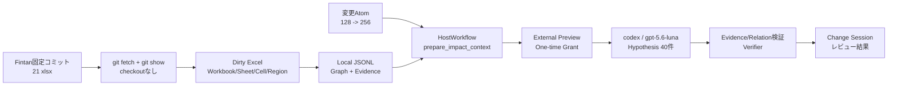

# Fintan互換性ベンチマーク実験報告書

## 文書メタデータ

| 項目 | 内容 |
| --- | --- |
| 文書種別 | 実設計書互換性ベンチマーク報告書 |
| 対象 | SpecImpact v1.3.0 Agent Host / Dirty Excel連携 |
| 実験シナリオ | プロジェクト名の最大長 128 → 256 |
| 実験日 | 2026-07-10 |
| 評価環境 | Windows、Python 3.11系、ローカルJSONL |
| 原典 | Fintan-contents/spring-sample-project |
| 固定コミット | `a0ce5854ac0b40025e89a5319c9157ef07650b65` |
| 判定の位置付け | 自動決定ではなく、Evidence付きレビュー支援 |

## エグゼクティブサマリー

Fintanの公開実設計書から、プロジェクト名変更に関係する21冊のExcel設計書を固定コミットから取得し、SpecImpactでローカル知識グラフ、Evidence、影響候補を生成した。原典ファイルはリポジトリへVendoringせず、取得時のSHA-256とコミットをprovenanceに記録した。

決定論的な最終結果は、期待影響19冊中19冊を検出し、負例2冊を誤って影響扱いせず、Evidenceアンカー20件中20件、Evidenceカバレッジ100%、セルアドレスカバレッジ100%、未知Sheet率0%であった。可視候補は40件で、上限60件以内だった。Verifier適用後は`must_review` 33件、`should_review` 7件となった。

Host LLMの意味往復は、`codex` host / `gpt-5.6-luna` / `external=true`で実施した。外部送信Previewを作成し、一回限りのApproval Grantを消費したうえで、40候補をEvidence付きHypothesisとして直接HostWorkflowへ提出した。Verifierによる最終結果は33件の`must_review`、7件の`should_review`で、Verifier拒否はなかった。

## 背景と目的

SIerの実設計書は、画面、DB、外部IF、バッチ、メッセージ、単体テストが複数のExcelに分散し、日本語論理名、物理名、コード、セル範囲が混在する。本実験の目的は、単純な文字列検索ではなく、変更値、設計要素、relation path、セルEvidenceを結び付けたレビュー候補を、公開実設計書で再現可能に確認することである。

対象変更は「プロジェクト名の最大長を128文字から256文字へ変更」である。SpecImpactは影響を自動確定せず、Evidence強度、関係距離、relation status、必要作業を提示し、人間レビューへ渡す。

## SpecImpactシステム概要

入力をDirty Excelとして読み込み、Workbook/Sheet/Cell/Regionを抽出する。Sheet分類とRegion分類を行い、ルールおよびHost LLMのGraph提案をEvidence付きGraphへ統合する。変更AtomからGraphを逆向きに辿り、影響候補を準備する。HostのHypothesisはEvidence IDとrelation IDを検証し、Verifierが最終優先度を決定してローカルJSONLへ保存する。

## 試験アーキテクチャと構成



Host実験の意味往復は、対象Workspaceの`HostWorkflow`を直接呼び出した。MCP stdio transportを経由して実設計書を提出したとは扱わない。MCP stdioのTool/Resource/Prompt handshakeは既存の自動テストおよびhandshake検証で確認した。

## 原典コーパス、ライセンス、Provenance

- リポジトリ: [Fintan spring-sample-project](https://github.com/Fintan-contents/spring-sample-project)
- コミット: `a0ce5854ac0b40025e89a5319c9157ef07650b65`
- 対象: supervisor baselineの21選定Workbook
- 取得方法: git objectを取得し、選定Blobだけを`git show`で展開。リポジトリ全体はCheckoutしない
- 保存方法: Excel原典はリポジトリへVendoringせず、実験用Workspaceへ取得
- 追跡: source path、短いlocal filename、commit、SHA-256を`provenance.json`へ記録
- 権利: ドキュメントは[Fintanコンテンツ使用許諾条項](https://fintan.jp/page/295/)、上流source codeはApache License 2.0。利用者は原典の条項と帰属表示を確認する

## 変更シナリオと対象

変更Atomは`length`、before=`128`、after=`256`である。対象Workbookは次の設計種別を含む。

- Domain definition、A1 table definition
- 画面機能仕様 WA10201/02/03/06
- バッチ機能仕様 BA10601/02/03
- 外部IF N21AA001/002/003
- 画面・バッチメッセージ仕様
- 画面単体テスト WA10201/02/03/06
- バッチ単体テスト BA10601/02/03

## 試験範囲、方法、受入ゲート

取得・取込・分類・Region検出・Graph構築・変更Atom解析・影響候補検索・Host Hypothesis提出・Verifier判定・結果保存を対象とした。期待影響Workbookは19冊、負例は2冊とした。

受入ゲートは次のとおりである。

1. 21冊の取得、固定commit、Provenance SHA-256を検証する。
2. 期待影響Workbook recallが19/19である。
3. 負例を含むfalse positiveが0件である。
4. Evidenceアンカー20/20、Evidence coverage 100%、cell-address coverage 100%である。
5. unknown sheet rateが10%以下、候補数が60以下である。
6. Host提出は候補path内のEvidence IDとrelation IDだけを参照する。
7. 外部送信はPreviewと一回限りGrantを経由し、監査Ledgerへ記録する。

## 初回失敗と是正

初回の決定論的実験では、広いRegionのmention Evidenceが先頭行だけを保持していたため、後半にある境界テストのセルアンカー2件を取りこぼした。Region内の各matching rowについてEvidenceを生成し、一つのrelationへ複数のEvidenceを保持するように是正した。再実行では20件のアンカーをすべて検出した。

Hostの実験では、`ev.1234567890`のような不透明なEvidence IDが、単独の7〜12桁数値と同じ規則で`ev.[REDACTED]`へ変換される不具合を確認した。Evidence IDのようなopaque identifierは保持し、単独の7〜12桁数値だけをRedactする修正後、Fresh external prepare/submitは初回提出で成功し、Redacted/missing Evidence IDは0件だった。

試験ハーネスでは、Windows PowerShellの既定文字コードにより日本語`required_actions`が`?`へ置換される事象も確認した。これはSpecImpact本体ではなく投入ハーネスの問題であり、ASCII sourceとUnicode escapeを使うUTF-8安全な経路で再提出した。最終保存結果40件を再読込し、`required_actions`、reason、warningsの置換文字が0件であることを確認した。

## 最終決定論的結果

### 規模

| 指標 | 結果 |
| --- | ---: |
| Workbook | 21 |
| Sheet | 160 |
| Cell | 222,480 |
| Region | 776 |
| Graph proposal | 734 |
| Artifact | 287 |
| Entity | 141 |
| Relation | 565 |
| Evidence | 721 |

### 受入結果

| 指標 | 結果 |
| --- | ---: |
| 期待影響Workbook | 19/19 |
| False positive | 0 |
| Evidence anchor | 20/20 |
| Evidence coverage | 100% |
| Cell-address coverage | 100% |
| Unknown sheet rate | 0% |
| Visible candidate | 40、上限60以下 |
| Ingest | 31.680秒 |
| Analyze | 0.718秒 |
| Deterministic run ID | `1f54f695f636` |

候補のArtifact type内訳は、TestCase 13、Screen 6、ExternalIF 5、Table 5、Batch 4、Column 4、ValidationRule 3である。

Sheet分類の内訳は、cover 43、revision history 21、DB mapping 28、screen item 19、batch 13、external interface 12、validation 2、test case 22で、合計160 Sheetである。「はじめに」をWorkbook名から設計表へ誤継承させず、coverとして扱う補正を最終実行へ反映した。

## Host LLM結果

`codex` host / `gpt-5.6-luna` / external previewを使用し、ユーザー承認済みの一回限りGrantを消費した。40候補すべてについて、候補path内のEvidence IDとrelation ID、Artifact種別に応じた日本語のrequired actionsを提出した。

| 結果 | 件数 |
| --- | ---: |
| Submitted hypotheses | 40 |
| must_review | 33 |
| should_review | 7 |
| Verifier downgrade | 7 |
| Verifier rejection | 0 |
| Redacted/missing Evidence ID | 0 |
| UTF-8 replacement text | 0 |
| Host run ID | `2bbffd1bd005` |

7件のdowngradeは、バッチ機能仕様で変更PropertyとArtifact種別の関係が弱いもの4件、直接before値がEvidenceにない単体テスト・画面検証系3件であった。`must_review`はLLMの提案値ではなく、VerifierがEvidenceとGraph pathを確認した後の結果である。

## 回帰・品質結果

- Release-check: 21 cases pass。recall、precision、evidenceはいずれも1.0。
- Fintanおよび関連focused regression: 42 tests pass。
- 最終redaction回帰2件: pass。
- Full suite: 249 passed、1 skipped。
- MCP stdio: 実コーパスのHost提出経路ではなく、既存の自動テスト/handshake検証でtyped Tools、Resources、Promptsを確認。

## 発見事項と含意

1. 複数Workbookの同一変更は、論理名だけでなく物理名、コード、セル範囲、relation pathを併用することで、設計種別を横断して追跡できる。
2. 負例を明示すると、検出率だけでなく「影響なし」とした設計書の妥当性を同時に確認できる。
3. Host LLMの出力はrequired actionsの具体化に有効だが、優先度はVerifierのEvidence判定へ委ねる必要がある。
4. Evidence IDは機密値ではない不透明識別子であり、数値Redaction規則と分離しなければHost往復を壊す。

## 既知の制約とリスク

- 12 Sheetに未解析のDrawing/Imageがあり、画像内の視覚的意味は解析していない。
- unresolved mentionが1件残っている。
- 画像、図形、自由配置レイアウトの意味はセルEvidenceだけでは保証できない。
- 今回のHost semantic round tripは直接HostWorkflowで実施した。実コーパスをMCP stdio経由で提出したものではない。
- `must_review`は最終決定ではなく、人間が原典とEvidenceを確認するための優先度である。
- 実験時間はWindows上の測定値であり、CPU、ストレージ、Python依存関係により変動する。

## 推奨する次アクション

1. Drawing/Imageをセル外Evidenceとして扱う設計と、画像内テキストの手動確認導線を検討する。
2. unresolved mentionのレビューを完了し、alias catalogへ承認結果を反映する。
3. 21冊の実CorpusでMCP stdioのprepare/authorize/submit往復を別のtransport検証として実施する。
4. Host actionsの日本語テンプレートを、画面、DB、外部IF、バッチ、境界テストの標準作業項目として管理する。

## 再現手順

```powershell
python -m pip install -e ".[dev,mcp]"
specimpact benchmark fetch-fintan .\temp\fintan-corpus
specimpact benchmark run-fintan .\temp\fintan-corpus `
  --workspace .\temp\fintan-workspace `
  --aliases .\examples\fintan_benchmark\aliases.yml `
  --change .\examples\fintan_benchmark\change_project_name_length.md `
  --expected .\examples\fintan_benchmark\expected_project_name_length.json
specimpact release-check .\examples\evaluation\release_cases.yml
pytest -q tests/test_fintan_change_atoms.py tests/test_fintan_evaluation.py tests/test_fintan_fetch.py tests/test_fintan_impact_retrieval.py tests/test_fintan_sheet_classification.py tests/test_dirty_excel_mentions.py
pytest -q
ruff check .
python -m compileall -q specimpact
```

Host実験を再現する場合は、対象Workspaceを初期化した後、HostContextを`host=codex`、`model=gpt-5.6-luna`、`external=true`で作成し、`prepare_impact_context`、Preview確認、Approval Grantのissue/consume、Evidence付き`submit_impact_hypotheses`の順で実行する。MCP stdio経由の実コーパス提出とは区別する。

## 変更ファイルサマリー

- `specimpact/benchmarks/fintan.py`: 固定Corpus fetch、Provenance検証、決定論的評価。
- `specimpact/dirty_excel/mention_graph.py`: Sheet mentionとセルEvidenceのGraph接続。
- `specimpact/dirty_excel/sheet_classifier.py`、`region_detector.py`: Workbook hintと設計表分類の強化。
- `specimpact/impact_management/change_atoms.py`、`impact_retrieval.py`、`llm_graph/*`: 128→256解析、経路、Verifier対応。
- `specimpact/cli.py`: `benchmark fetch-fintan`、`benchmark run-fintan`。
- `specimpact/graphrag.py`: opaque Evidence IDを保持する外部送信redaction境界。
- `tests/test_fintan_*.py`、`tests/test_dirty_excel_mentions.py`、`tests/test_host_workflow.py`: fetch、回帰、評価、Host接続のfocused tests。
- `examples/fintan_benchmark/*`: Manifest、aliases、change request、expected oracle、利用手順。原典Workbook自体は含めない。
- `README.md`、`docs/cli.md`、`docs/mcp.md`、`docs/user_manual_ja.md`: 公開CorpusとCodex MCPの再現手順。

## ScopeチェックとFuture-phase leakageチェック

本実験の範囲は、固定公開Corpusの取得、ローカルEvidence Graph、決定論的影響候補、Host prepare/submit、Verifier、Provenance、ドキュメント化に限定した。設計書の自動編集、Neo4j必須化、外部LLM必須化、Excel/PDF/docxの新規変換、Web UIの新規実装、SharePoint/Microsoft Graph、NotebookLM、M365 Copilot remote MCP、VS Code custom editorは導入していない。
